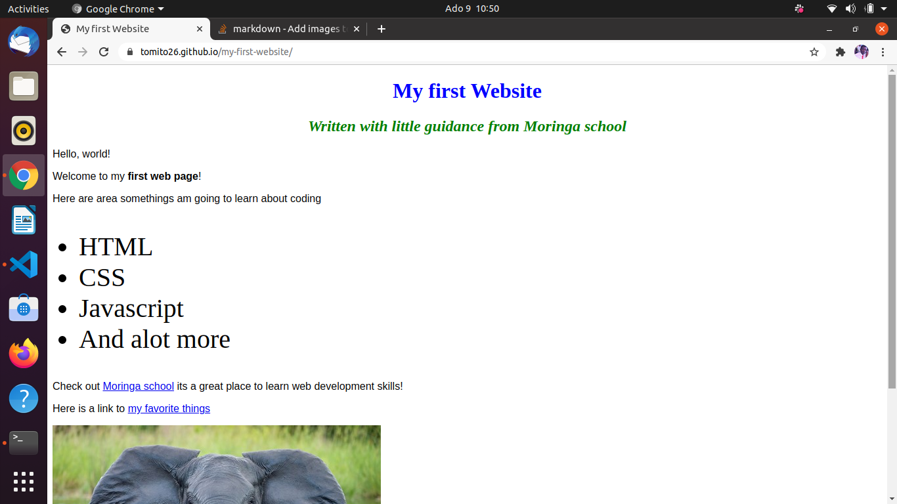

# My First Website

 This website is mainly for practice for basic HTML,css,git,and the terminal.Here is the [link](https://tomito26.github.io/my-first-website/)

## Contributors:
* Thomas Khaemba
## How to access it
- You git clone the [repository](https://github.com/tomito26/my-first-website.git) on your desired directory
```
$ cd directoy
$ git clone <repository>
$cd <directory of the repo>
$ code .
```
## How  to contribute
You can contribute by forking the project then you clone the project to your local machine

## Technology used
* HTML
* CSS
## Lincense and copyright
Copyright (c) 2020 Thomas Khaemba

Licensed under  the [MIT License](LICENSE).